# Arquitectura de Software

## Separacion de capas

El proyecto de Chacha20 en RISC V se divide en dos capas principales
- **C (alto nivel)**
Donde se maneja:
- Control del flujo del programa
- Entrada de datos (key, nonce, counter, plaintext, etc)
- Definición de las cadenas de datos o buffers (ciphertext, keystream)
- Impresión de resultados (UART)
- Funciones de prueba

- **Ensamblador RISC V (bajo nivel)**
Acá se maneja:
- Implementación de las funciones críticas para el funcionamiento de chacha20 (`quarter_round`, `chacha20_block` y `chacha20_encrypt`)
- Manipulacion directa de registros

## Interfaces

Las funciones en ensamblador son llamadas desde C mediante `extern`:
```bash
extern void quarter_round(uint32_t *state, int a, int b, int c, int d);
extern void chacha20_block(uint32_t *output, uint32_t *key, uint32_t counter, uint32_t *nonce);
extern void chacha20_encrypt(uint8_t *plaintext, uint8_t *ciphertext, uint32_t length, uint32_t *keystream, uint32_t *key, uint32_t counter, uint32_t *nonce);
```

Esto nos permitió generar modularidad de código y un fácil acceso a las funciones necesarias para ejecutar el algoritmo chacha20.

## Justificacion de diseño

Se utiliza C para una mayor facilidad de desarrollo y más facilidad a la hora de realizar test. Por la parte de ensamblador, nos permite tener un control más preciso del hardware, eligiendo así cuando acceder al stack y a qué registros dirigirnos, así también se puede llegar a optimizar de mejor manera el código, gracias a la implementación en ASM también se logró comprender de mejor manera como funcionan las implementaciones de programas en arquitecturas modernas como lo es RISC V.

Ahora, para las funciones implementadas en ASM:

### `quarter_round`

Siguiendo las etiquetas implementadas:

- `quarter_round`: La función completa como tal está en esta etiqueta, acá se definieron los registros y se hacen todas las operaciones relacionadas con el  `quarter_round`, se realizó así de manera normal para evitar complicaciones con un loop mal implementado.


### `chacha20_block`

Siguiendo las etiquetas implementadas:

- `chacha20_block`: La etiqueta de llamada a la función, acá se definen los registros iniciales para trabajar con el `chacha20_block`
- `loop_working_state`: Acá implementé un loop para generar el `working_state`, el cuál al inicio es igual a state, pero después le vamos a aplicar las 20 rondas con `quarter_round`, lo implementé como un loop ya que es la forma más eficiente de llenar el array sin tener que usar fuerza bruta
- `loop_working_state_done`: Acá saltamos una vez terminamos el `loop_working_state`, y de una vez definimos el contador y limite de contador para `inner_block`
- `inner_block`: En esta etiqueta empezamos a realizar el `inner_block`, el cual se trata en las 20 rondas con diferentes constantes para a, b, c y d con `quarter_round` (las columnas y las diagonales), de igual manera fue implementado con un loop para evitar fuerza bruta
- `inner_block_done`: Saltamos acá una vez terminamos las 20 rondas de `quarter_round` y definimos el contador y limite de contador para `loop_working_state_final`
- `loop_working_state_final`: Este loop es implementado para generar el `working_state` final, el cual se trata de `working_state[i] = working_state[i] + state[i]`, igual se implementó como un loop para evitar código repetitivo y mejorar la legibilidad.
- `loop_working_state_final_done`: Una vez terminamos de generar el `working_state` final, saltamos acá y definimos el contador y limite de contador para `loop_output`
- `loop_output`: Este último loop se encarga de traspasar todo el  `working_state` a `output`, igualmente con un loop para más eficiencia
- `loop_output_done`: Finalmente, una vez termina el `loop_output`, saltamos acá, donde ya devolvemos `output` a a0, cargamos todos los saved registers y restauramos el stack


### `chacha20_encrypt`

Siguiendo las etiquetas implementadas:

- `chacha20_encrypt`: Es la etiqueta de llamada a la función, acá se definen todos los registros que serán necesarios durante la ejecución de `chacha20_encrypt`
- `encrypt_loop_i`: Este loop se puede ver como el loop "externo" de la función, donde se llama a `chacha20_block` y se aumenta el counter al final cuando regresa desde `encrypt_loop_j` y restamos 64 a `length` del plaintext, se implementó así porque es la solución que encontré más coherente
- `encrypt_loop_j`: Este loop es el loop para realizar la operación  `ciphertext[i] = block[i] ^ keystream[i]`, pero este loop solo se llama cuando el `length` restante es mayor a 64, ya que aca debemos trabajar hasta que el contador llegue a 64, una vez llegue a 64 volvemos a `encrypt_loop_j` para crear el siguiente bloque
- `encrypt_loop_intermedio`: Este loop solo se llama cuando el `length` restante es menor o igual a 64, ya que sería el último bloque, este loop termina una vez el contador llega a `length` y salta a  `encrypt_loop_done`
- `encrypt_loop_done`: Es la última etiqueta, acá devolvemos los registros a su estado original, cargamos los saver registers y restauramos el stack

---

# Mapeo de registros

## Para `quarter_round`

En la función quarter_round, los registros de argumentos quedaron repartidos de la siguiente manera:

- a0 = state
- a1 = indice a
- a2 = indice b
- a3 = indice c
- a4 = indice d

Después, para la realización de las operaciones se utilizaron los registros temporales desde el t0 hasta el t6. Para el final, el state actualizado queda en el registro a0

## Para `chacha20_block`

Para la función `chacha20_block`, los registros de argumento quedaron repartidos de la siguiente forma:

- a0 = output
- a1 = key
- a2 = counter
- a3 = nonce

Ahora, aparte de registros temporales t, se utilizaron saved registers, los cuales quedaron de la siguiente manera:

- s0: Registro para state, que es un array donde lo vamos a formar con el key, counter y nonce
- s1: Registro para el working_state, que es igualmente un array pero para el `working_state`
- s2: Registro para no perder el valor original de a0 (output) ya que después el registro a0 será utilizado para llamar a `quarter_round`
- s3: Registro para evitar problemas con el contador en `inner_block`
- s4: Registro para evitar problemas con el loop de `inner_block`

Todos estos registros se guardan al inicio y se cargan al final para cumplir con las convenciones de RISC V.

Finalmente, el registro de valor de retorno es el registro a0, el cuál contiene output que es el keystream generado por el chacha20_block.

## Para `chacha20_encrypt`
Para la función `chacha20_encrypt`, los registros de argumento quedaron de la siguiente manera:

- a0 = plaintext
- a1 = ciphertext
- a2 = length (del plaintext ingresado)
- a3 = keystream
- a4 = key
- a5 = counter
- a6 = nonce 

En esta función, aparte de registros temporales t utilizados en diferentes partes también se utilizaron saved registers, los cuales fueron los siguientes:

- s5: Registro utilizado para guardar el plaintext (a0) ya que el registro a0 será utilizado por el `chacha20_block` después
- s6: Registro utilizado para guardar el ciphertext (a1) ya que el registro a1 será utilizado por el `chacha20_block` después
- s7: Registro utilizado para guardar el length de plaintext (a2) ya que el registro a2 será utilizado por el `chacha20_block` después
- s8: Registro utilizado para guardar el keystream final (a3) ya que el registro a3 será utilizado por el `chacha20_block` después
- s9: Registro para el contador de `encrypt_loop_j` y `encrypt_loop_intermedio`
- s10: Registro que contiene el valor 64, el cuál es el límite al que llega s9 antes de volver a `encrypt_loop_i` y aumentar el counter, y este mismo registro se utiliza para restarlo al valor de `length`, para así ir detectando cuando quede un bloque de menos de 64 bytes y así saltar a `encrypt_loop_intermedio`, todo esto porque ChaCha20 opera sobre bloques de 64 bytes, por lo que este valor define el tamaño de procesamiento por iteración.
- s11: Registro contador que sirve para identificar la dirección real a la que debemos acceder en plaintext y ciphertext

Todos estos registros se guardan al inicio y se cargan al final para cumplir con las convenciones de RISC V.

Finalmente los registros principales de donde se toma los valores de salida son:
- a1 = ciphertext
- a3 = keystream

---

# Evidencias de ejecución
Se realizaron pruebas utilizando GDB sobre QEMU para verificar el comportamiento del algoritmo

## `quarter_round`

Para el `quarter_round`, utilizamos los vectores de pruebas del RFC pero en un state previo, así confirmamos primero que cambie a el valor que es y que sea justo en la posición indicada en el `quarter_round` (a,b,c y d), entonces, se obtuvieron los siguientes resultados en las posiciones 0, 4, 8 y 12, y los comparamos con los del RFC

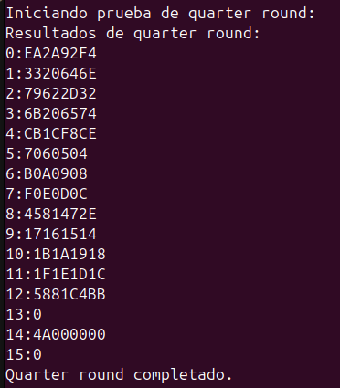

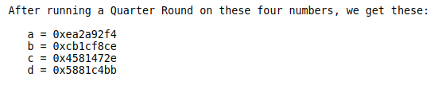

## `chacha20_block`
Se inspeccionó el state inicial antes de las 20 rondas con un break:
```bash
break loop_working_state
```
Y revisamos el state inicial y lo comparamos con el de RFC:
```bash
x/16xw $s0 
```

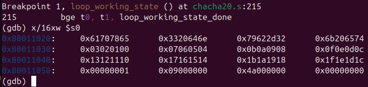

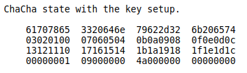

Luego se inspeccionó el estado final después de las 20 rondas con un break
```bash
break loop_output_done
```
Y revisamos el output que esta almacenado temporalmente en s2:
```bash
x/16xw $s2
```
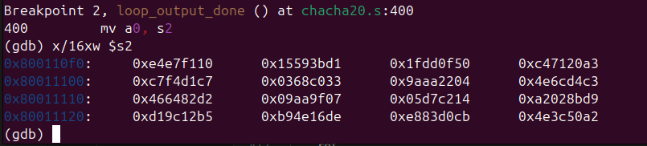

Verificamos los resultados obtenidos con los vectores esperados del RFC

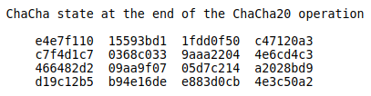


## `chacha20_encrypt`
Para ver el funcionamiento interno, añadimos un break en `encrypt_loop_j` y `encrypt_loop_intermedio` para ver los keystreams generados para cada counter:
```bash
break encrypt_loop_j
break encrypt_loop_intermedio
```
Y revisamos a0 (donde se encuentra actualmente el keystream) y comparamos con el RFC:

```bash
x/16xw $a0
```
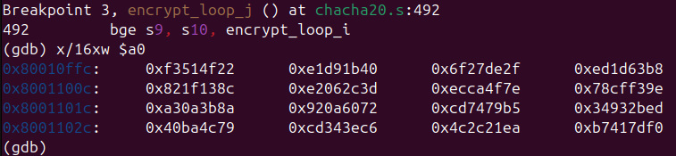

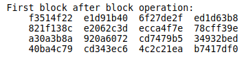

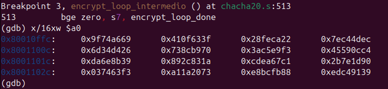

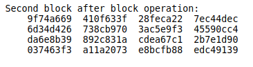

Después vemos el resultado del ciphertext y del keystream finales, junto con el descifrado del mismo ciphertext, y comparamos el ciphertext con el del RFC:

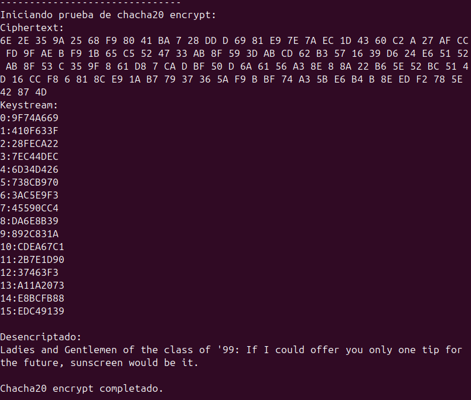

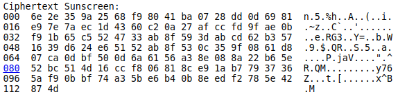

---

# Bitácora de un bug

Un bug que tuve en `chacha20_encrypt` fue que como para `chacha20_block` ocupaba utilizar los registros a1, a2 y a3 como registros de argumento los cuales pueden ser sobrescritos durante llamadas a funciones, por lo mismo, el contenido de ellos que estaba antes de ser llamado por `chacha20_block`, se perdía, ya que dentro de `chacha20_block` se llamaba a `quarter_round`, y este ocupaba estos registros para a, b y c, por lo que cambiaban, pero antes, el contenido de estos registros originalmente era el key, counter y el nonce, por lo que le entraba un resultado que no tenía nada que ver con lo que necesitaba. Básicamente este problema ocurrió debido a no preservar correctamente registros, por lo que al final resultaba en que el programa nunca se ejecutaba, entonces la solución fue guardar los registros en memoria con:
```
sw a1, 32(sp) # Guardamos key (a4 original)
sw a2, 36(sp) # Guardamos el counter original
sw a3, 40(sp) # Guardamos nonce (a6 original)
```
Y antes de llamar a `chacha20_block` los reconstruíamos:

```
lw a1, 32(sp) # key restaurada desde stack
lw a2, 36(sp) # counter restaurado desde stack
lw a3, 40(sp) # nonce restaurada desde stack
    
call chacha20_block
```
Así se veía a1(key),a2(counter) y a3(nonce) antes de la corrección:

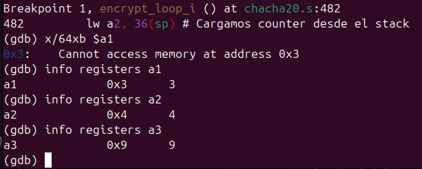

Después de la corrección:

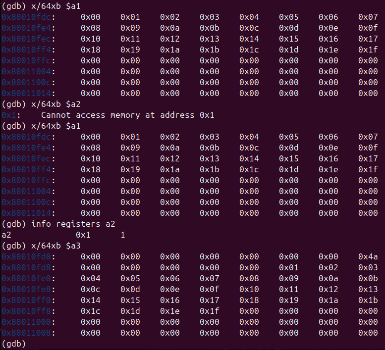

---

# Análisis de los resultados obtenidos

Los resultados obtenidos tanto de `quarter_round`,`chacha20_block` y `chacha20_encrypt` fueron exitosos, ya que todos coinciden de manera exacta con los resultados que presenta el RFC, utilizando los mismos vectores de prueba

